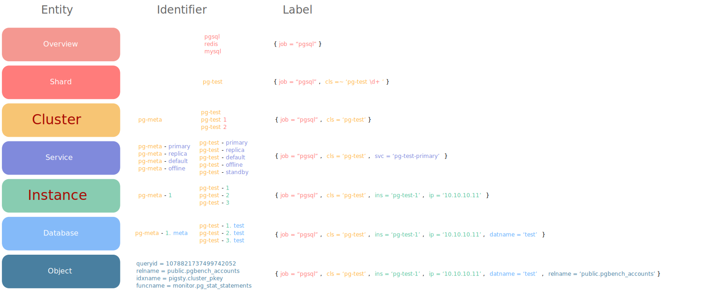
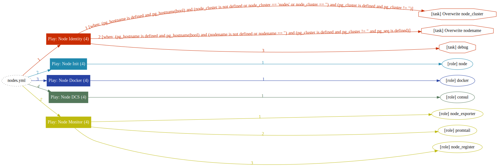

# Service Discovery

This article describes the mechanism used by the Pigsty monitor system Prometheus to discover monitor objects.

The basis of service discovery is **identity**. For more identity information, please refer to the section [**entity**](c-pgsql.md#ER-Model).

It would help if you also associated **monitor targets** with the identity in the monitor system, and Pigsty provides two implementations.

* [Static File Service Discovery](#static-file-service-discovery): Using an automatically maintained configuration file (default).
* [Consul service discovery](#Consul-service-discovery): Uses automatically maintained Consul service registration information.

The static file is the default service discovery mechanism. Before v1.0.0, Consul was the default service discovery method, and the discovery mechanism could be configured via parameters.


## Identity

All instances have an **Identity,** and the **Identifier** is the **metadata** associated with the instance to identify it.

An [**Identity parameter**](v-pgsql.md#pg_identity) is a unique identifier that must be defined for any cluster with an instance.

| name | variables | abbreviation | type | description |
| :--: | :-----------: | ------ | ---------------- | --------------------------------------------- |
| cluster | `pg_cluster` | `cls` | **Core identity parameters** | Cluster name, top-level namespace for resources within the cluster |
| role | `pg_role` | `role` | **core identity parameters** | instance role, `primary`, `replica`, `offline`,... |
| seq | `pg_seq` | `seq` | **core identity parameters** | Instance serial number, positive integer, unique within the cluster. |
| instance | `pg_instance` | `ins` | derived identity parameters | `${pg_cluster}-${pg_seq}` |
| service | `pg_service` | `svc` | derived identity parameters | `${pg_cluster}-${pg_role}` |




## Attach Identity

After naming the objects in the system, you also need to associate **identity information** to specific instances.

Identity information is business-given metadata, and the database instance is not aware of this identity information.

The most straightforward way to associate identities is **Operator's memory**: the DBA remembers in his mind that the instance on IP `10.2.3.4` is the one used for payments. In contrast, the instance on the other one is used for user management. A better way to manage the identity of cluster members is through the **config file** or by using **service discovery**.

Pigsty provides both ways of identity management: service discovery based on the [**Consul**](#consul-service-discovery) and service discovery based on the [**config file**](#static-file-service-discovery).

The parameter [`prometheus_sd_method`](v-infra.md#prometheus_sd_method) controls this behavior.

- `consul`: service discovery based on Consul, default config.
- `static`: service discovery based on local config files.

Pigsty recommends using `static` service discovery, which is more concise and more reliable as the monitor system does not need to rely on Consul.


## Static File Service Discovery

Static file service discovery is the default method of monitor object discovery, and Pigsty pulls the config using the following config by default.

```yaml
#------------------------------------------------------------------------------
# job: pgsql (database monitoring)
# node_exporter | pg_exporter | pgbouncer_exporter | haproxy(exporter)
# labels: [cls, ins, instance]
# path: targets/pgsql/*.yml
#------------------------------------------------------------------------------
- job_name: pgsql
  metrics_path: /metrics
  file_sd_configs:
    - refresh_interval: 10s
      files: [ /etc/prometheus/targets/pgsql/*.yml ]
```

The `/etc/prometheus/targets` dir holds the monitor object definition files generated by Pigsty, and `pgsql` is the name of the default environment.

**Each instance is register by a standalone file:**

```
/etc/prometheus/targets/pgsql
                     ^-----pg-meta-1.yml
                     ^-----pg-test-1.yml
                     ^-----pg-test-2.yml
                     ^-----pg-test-3.yml
```

Its content is the **identifier** on a single instance, with **monitor objects**.

```bash
# pg-meta-1 [primary] @ 10.10.10.10
- labels: { cls: pg-meta, ins: pg-meta-1 }
  targets: [10.10.10.10:9630, 10.10.10.10:9100, 10.10.10.10:9631, 10.10.10.10:9101]
```


### Maintenance Document Service Discovery

When using static file service discovery, these config files are automatically maintained for all cluster expansion and downsize.

The config files will be regenerated for all instances in the environment using the following command.

```bash
./pgsql.yml -t register_prometheus
```

### Default Targets

Each managed Postgres instance includes several capture ports.

* [Node Exporter](https://github.com/prometheus/node_exporter) for capturing machine node metrics.
* [PG Exporter](https://github.com/Vonng/pg_exporter) for capturing database metrics.
* [PGBouncer Exporter](https://github.com/Vonng/pg_exporter) for capturing connection pool metrics (uses the same binary as PG Exporter).
* [Patroni](https://patroni.readthedocs.io/en/latest/releases.html?highlight=%2Fmetrics#version-2-1-3) for capturing HA components.
* [HAProxy](https://github.com/Vonng/haproxy-rpm) for capturing LB metrics (built-in support, no separate deployment required). 



Prometheus on the [meta node](c-nodes.md#meta-node) captures these capture ports.

In addition, the optional Promtail for collecting Postgres, Patroni, and Pgbouncer logs.

All monitoring ports are registered to Consul by default, but Prometheus manages these tasks by default using static file service discovery.
Users can use Consul service discovery by configuring [`prometheus_sd_method`](v-infra.md#prometheus_sd_method) as `consul` to manage instances dynamically.


## Consul Service Discovery

Pigsty has built-in DCS-based config management and automatic service discovery, which provides a visual overview of all nodes and services in the system and their health status. All services in Pigsty are automatically registered with DCS.

Users can also use the DNS and service discovery mechanism provided by Consul to achieve automatic DNS-based traffic switching.

Consul uses a Client/Server architecture, with one to five Consul Servers in the entire environment for the actual metadata storage. Consul Agent is deployed on all nodes to proxy the communication between local services and the Consul Server. Pigsty registers services by default using local Consul config files.

### Service Registration

A consul agent is running on each node, and services are registered to DCS by the consul agent using JSON config files.

The default location of the JSON config file is `/etc/consul.d/`, using the naming pattern of `svc-<service>.json`, taking `postgres` as an example.

```json
{
  "service": {
    "name": "postgres",
    "port": 5432,
    "tags": [
      "pgsql",
      "primary",
      "pg-meta"
    ],
    "meta": {
      "type": "postgres",
      "role": "primary",
      "seq": "1",
      "instance": "pg-meta-1",
      "service": "pg-meta-primary",
      "cluster": "pg-meta",
      "version": "13"
    },
    "check": {
      "args": ["/usr/pgsql/bin/pg_isready", "-p", "5432", "-U", "dbuser_monitor"],
      "interval": "15s",
      "timeout": "1s"
    }
  }
}
```

Where the `meta` and `tags` sections are the metadata of the service and store the **identity information** of the instance.

### Service Inquiry

Users can discover **services registered to Consul** through the DNS service provided by Consul, or by calling the Consul API directly.

See [Consul doc](https://www.consul.io/docs/discovery/dns) for ways to consult consul services using the DNS API.

### Service Discovery

Prometheus automatically discovers monitor objects in the env via `consul_sd_configs`. Services tagged with both `pg` and `exporter` are automatically identified as crawlers.


```yaml
- job_name: pg
  # https://prometheus.io/docs/prometheus/latest/configuration/configuration/#consul_sd_config
  consul_sd_configs:
    - server: localhost:8500
      refresh_interval: 5s
      tags:
        - pg
        - exporter
```

> **Figure: In services discovered by Prometheus**, identity information has been associated with the metric dimension of the instance.


### Service Maintenance

A database primary-replica switch occurs, resulting in a registered role that is different from the actual role of the instance. This is when such anomalies need to be handled through the anti-entropy process. Patroni-based failover can fix the registered roles normally through callback logic, but manually done role switchover requires manual intervention to take it. Service registrations to the database can be detected and fixed automatically using the following script. It is recommended to configure Crontab on the database instance or set up periodic patrol tasks on the meta node.


```bash
/pg/bin/pg-register $(pg-role)
```


## Labels

Either through Consul or static file service discovery. The end effect is to achieve an association between **identity information** and **instance metrics**.

This correlation is achieved through the **dimensional labels** of the monitoring metrics.

However, all original metrics related to database clusters in Pigsty must have both `cls` and `ins` tags and remain immutable throughout their lifecycle.

| Identity parameters | Dimension labels | Sample values |
| :-----------: | :------: | :---------------: |
| `pg_cluster` | `cls` | `pg-test` |
| `pg_instance` | `ins` | `pg-test-1` |
| `node_ip` | `ip` | `10.10.10.11` |


Read the next section of [metrics](m-metric.md) to learn how labels organize these metrics.

