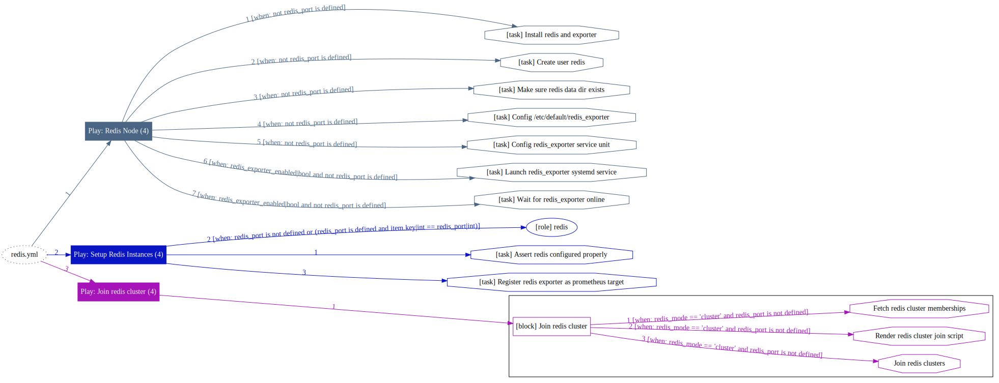

# 剧本：REDIS

> 使用REDIS系列[剧本](p-playbook.md)，定义并拉起 传统主从、集群、Sentinel模式的Redis数据库。

| 剧本 | 功能                                                         | 链接                                                         |
|--------|--------------------------------------------------------------| ------------------------------------------------------------ |
|  [`redis`](p-redis.md#redis)                        |        部署集群/主从/Sentinel模式的Redis数据库              |        [`src`](https://github.com/vonng/pigsty/blob/master/redis.yml)            |
|  [`redis-remove`](p-redis.md#redis-remove)          |        Redis集群/节点下线                                   |        [`src`](https://github.com/vonng/pigsty/blob/master/redis-remove.yml)     |


------------------

## `redis`

用于在节点上部署Redis集群，节点，实例。


```bash
# init all redis instances on group <cluster>
 ./redis.yml -l <cluster>    # create redis cluster

# init redis node (package,dir,exporter)
 ./redis.yml -l 10.10.10.10    # create redis cluster

# init all redis instances specific node
 ./redis.yml -l 10.10.10.10    # create redis cluster

# init one specific instance 10.10.10.11:6501
 ./redis.yml -l 10.10.10.11 -e redis_port=6501 -t redis

```



------------------

## `redis-remove`

用于从节点上移除所有Redis实例

```bash
# Remove cluster `redis-test`
redis-remove.yml -l redis-test

# Remove all instance on redis node 10.10.10.13
redis-remove.yml -l 10.10.10.13

# Remove one specific instance 10.10.10.13:6501
redis-remove.yml -l 10.10.10.13 -e redis_port=6501
```


